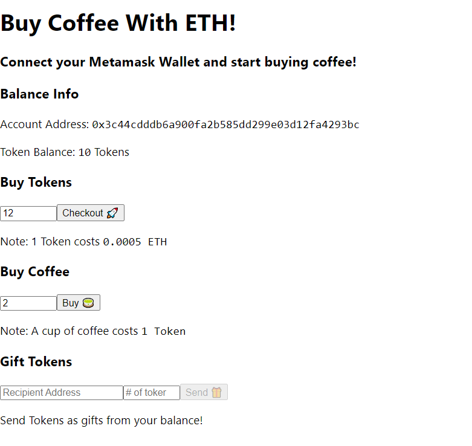

# Zero Knowledge Based Voting project using React and Ethereum

It's a Zero Knowledge Based Voting project using React and Ethereum.

## How I built this project from the beginning.

1. Clone a hardhat + react project as a starting boilerplate from: https://github.com/purusang/coffeeMachine
2. Install depenencies by npm install.
3. Ensure the cloned project is working fine by:
   1. Starting a node using a terminal/cmd line: npx hardhat node
   2. From another terminal compile the smartcontracts by: npx hardhat compile
   3. Now deploy the just compiled CoffeeMachine smartcontract by running te scripts/deploy.js: npx hardhat run --network localhost scripts/deploy.js
      Upon deploying the smart contract there must be two files (CM.json and contract-address.json) created inside frontend/src/contracts.
   4. Install the dependencies of react app by changing directory to frontend: cd frontend
      npm install
   5. Now run the react app by : npm start
      You will see a simple interface in which you will be able to mint tokens and buy coffee with those minted tokens. But make sure that the browser in which the app is opened has a wallet connected to your localhost. Also import some accounts from your local network to the wallet for testing purpose.
      Screenshot of the interface: 
4. Now work on zk-merkle-tree
   1. Update package.json as available.
   2. Create a prepare.sh file inside scripts folder.
   3. Create a deploy.ts file inside scripts folder.
   4. Run the following commands (in gitbash if in Windows).
      npm i
      npm run prepare (optional, npm i should run it)
      npm run deploy
      If you are able to see the following output then setup till now is good.:
      MiMC sponge hasher address: 0x5FC8d32690cc91D4c39d9d3abcBD16989F875707
      Verifier address: 0x0165878A594ca255338adfa4d48449f69242Eb8F
      ZKTreeVote address: 0xa513E6E4b8f2a923D98304ec87F64353C4D5C853
